# Magic Installer MSI Template

**This is a minimalist MSI installer 2-click generator for your pet projects for Windows (not necessarily pet ones, preferably written in C/C++ but not necessarily again).**

Magic works as all you need is to populate [_configMSI.yml](TFMCfW_Example_MSI/_configMSI.yml) with your own values, then:
* Run [___generate_msi_template.bat](TFMCfW_Example_MSI/___generate_msi_template.bat).
* Run [__build_msi_installer.bat](NewInstallerTemplateMSI/__build_msi_installer.bat).

**And voila! Magic is coming!**

Screenshots... | Screenshots...
----- | -----
 | 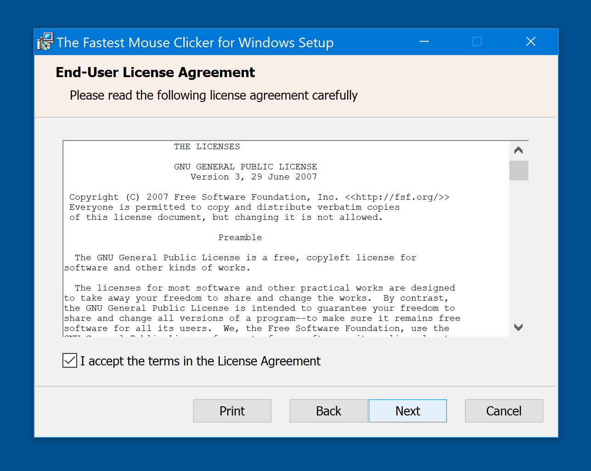
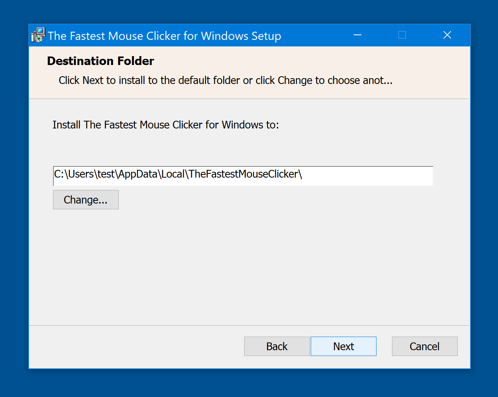 | 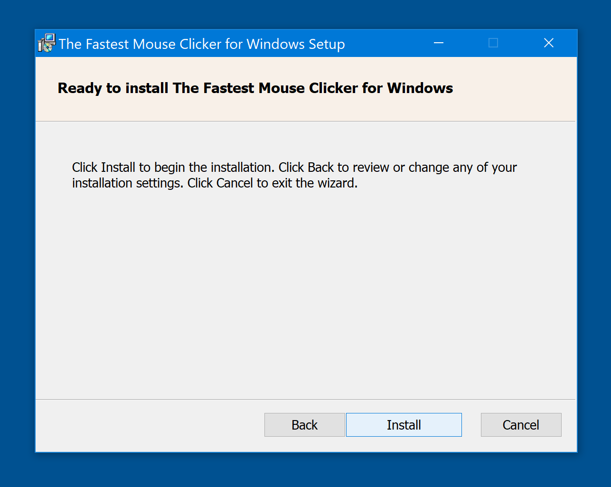
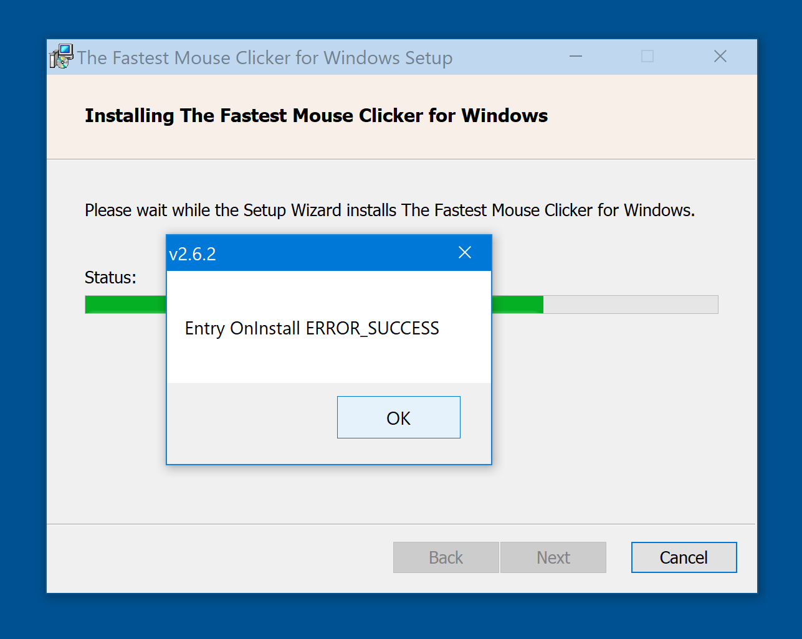 | 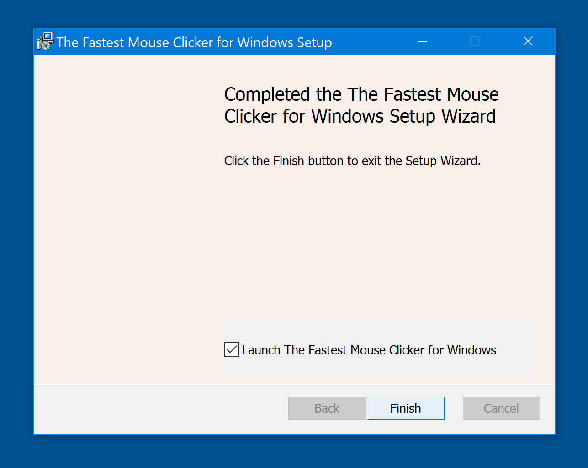
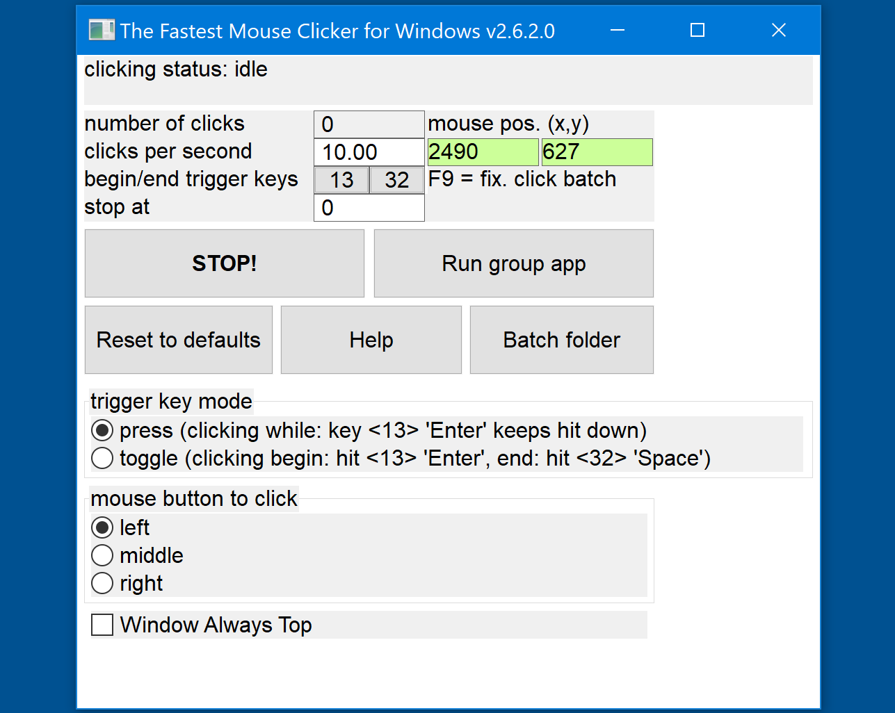 | 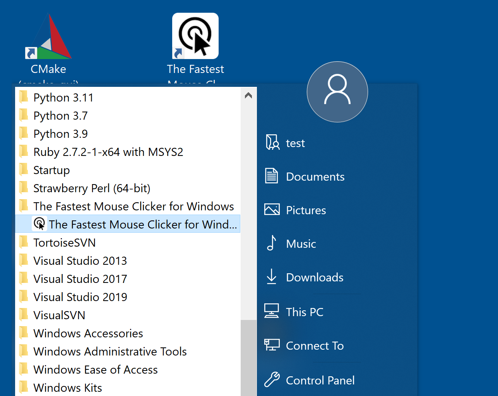
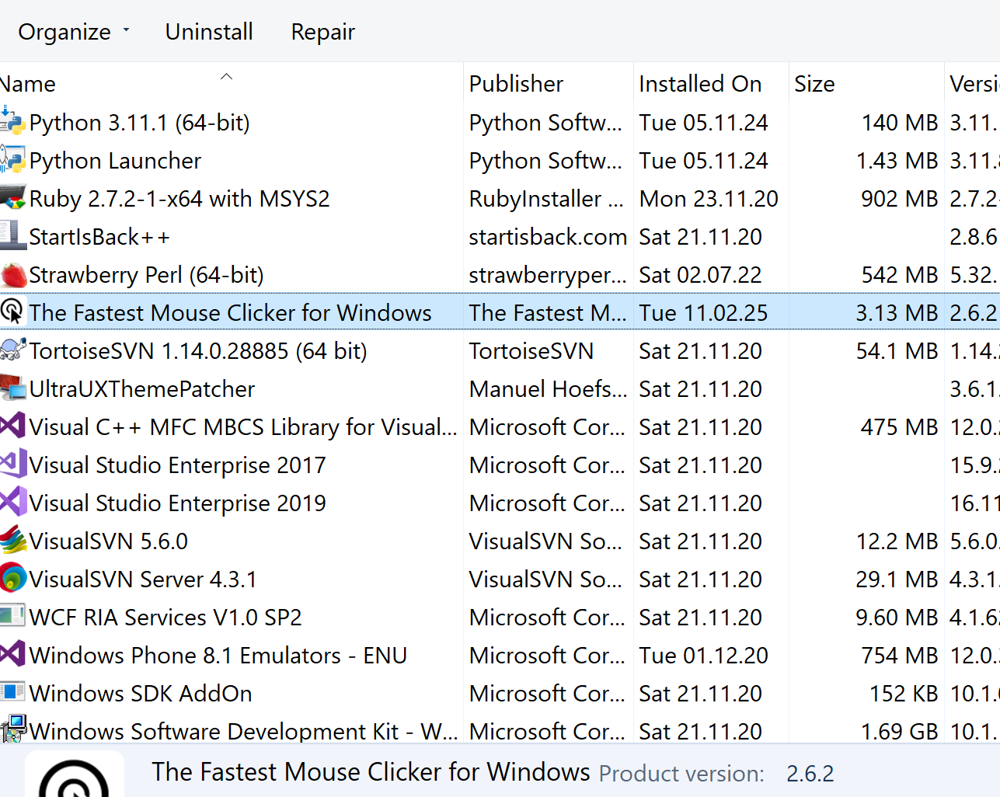 | 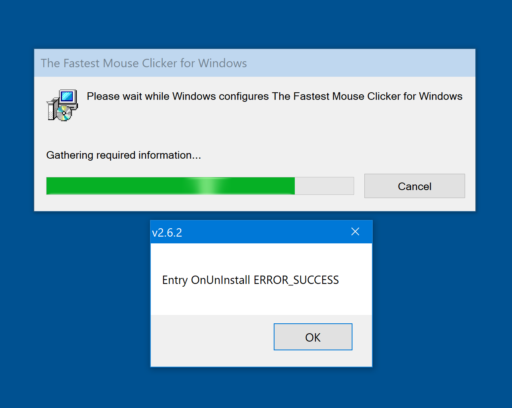
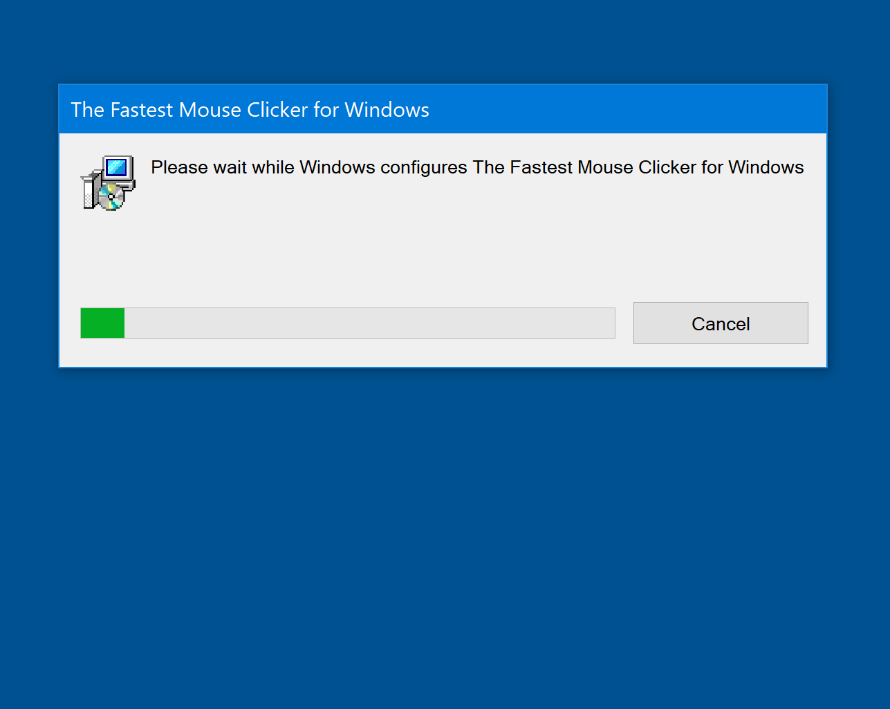 | 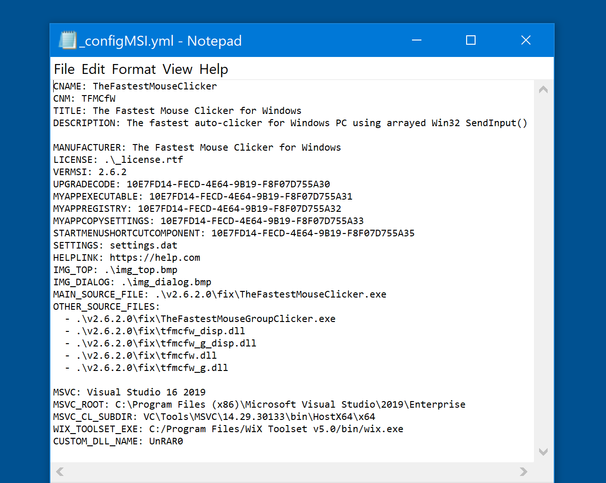

## Our goals

1. MSI installer is a modern, standard and recommended way to install your applications on Windows, it deserves more trust of end-users
and achieves less false-positive detection of antivirus software than any executable-based installer like [InnoSetup](https://jrsoftware.org/isinfo.php).
MSI installer supports a transaction/checkpoint-based installation, where a failed attempt could be rolled back.

2. Sad but truth: creating a MSI installer is a too complicated workflow, based on a \*.wxs configuration file that is a sophisticated XML variant.
[WiX Toolset](https://docs.firegiant.com/wix/using-wix/) has three different versions 3, 4, 5 that are somewhat incompatible with each other.
Furthermore, a vendor has no single conceptual approach what is indeed a correct way to create the MSI installers - whether all stuff should be generated from source files,
or an MSI installer should be created by developer's hands as a Microsoft Visual Studio project of a special type, and all things should be done by a developer visually
via the Visual Studio plugin and the GUI.

3. Meanwhile, most pet projects are sufficiently simple (and not only pet ones) in means of installation process. And even if that is not the case, we want to preserve
generality, allowing to create an installer of an arbitrary complexity via calling predefined functions form a custom DLL.

## Requirements to your pet project

1. Your project has a **single** main executable to install and arbitrary set of DLLs shipped with the executable. If your project has several
executables, consider to implement a feature to run them from each other.

2. Your project can be upgraded and downgraded easily without controlling a version info by the installer. Simple file copying is used always.

3. Your project has only one configuration file that is preserved and copied by the installer between the versions of the program during its upgrade/downgrade sequence.
We recommend to use [SQLite](https://www.sqlite.org/) since it is a mature ACID-transactional database library that implements a small, fast, self-contained, high-reliability,
full-featured, SQL database engine. SQLite is the most used database engine in the world.

4. Your project is shipped with a custom DLL that has two exported functions: OnInstall() and OnUnInstall(). OnInstall() will be called during installation process
(first-install/upgrade/downgrade/repair) after all project files are copied from the embedding installer cabinet file to the installation folder on disk.
OnUnInstall() will be called during uninstall before all project files are removed from disk, only if no installed product should remain on disk.
OnUnInstall() will **not** be called during upgrade/downgrade.

5. Your application does not require to escalate privileges.

## Features of the generated MSI installer

1. MSI installer creates a standard record about your installed product in a special Windows database with **TITLE** value from [_configMSI.yml](TFMCfW_Example_MSI/_configMSI.yml).

2. Product version is in 3-digit format, it is set by **VERMSI**. It is shown with **HELPLINK** in the Windows' Control Panel\\Programs\\Programs and Features
and Settings->Apps and features.

3. Default installation folder is %LOCALAPPDATA%\\**CNAME**, we recommend to avoid space symbols in this variable.

4. End-user can change the installation folder, and the application's configuration file **SETTINGS** will be automatically copied and preserved across the versions of your product.

5. If another version of your product was installed before, installer detects it via a registry key property Root="HKCU" Key="Software\\**CNAME**" Name="InstallPath" Type="string".
In this case, default installation folder will be the detected location.

6. During first-install/upgrade/downgrade end-user is prompted to check a "Launch **TITLE**" application checkbox after installation. This checkbox will not be shown during a repair.

7. Your license to agree should be in \*.rtf format with recommended font size 6pt, its disk path is set by **LICENSE**.

6. Your top background image to be shown the installer should be in 24-bit RGB, no color space, \*.bmp format, its disk path is set by **IMG_TOP**. We recommend a single-color, pale saturated image.

7. Your dialog background image to be shown the installer should be in 24-bit RGB, no color space, \*.bmp format, its disk path is set by **IMG_DIALOG**. We recommend a single-color, pale saturated image.

8. Installer creates a "Desktop" shortcut and a "Start Menu Programs" folder and shortcut from the icon embedded in the main executable, **MAIN_SOURCE_FILE**.

9. See [_configMSI.yml](TFMCfW_Example_MSI/_configMSI.yml) for further example. **Do not forget to set your unique GIUDs**.

## Prerequisites to magically generate the MSI installer on your PC

1. Python version 3.x, we use Python v3.11 as most advanced yet stable one. See example %PATH% from [___generate_msi_template.bat](TFMCfW_Example_MSI/___generate_msi_template.bat).
Set the **PYTHON_ROOT** value.

2. CMake version 3.15.x, we use 3.27.7. Set the **CMAKE_ROOT** and **MSVC** values.

3. MS Visual Studio 2019/2022 professional or enterprise as we build the custom DLL with /MT code generation flag (Static MultiThreaded Config).
Set the **MSVC_ROOT** and **MSVC_CL_SUBDIR** values.

4. WiX Toolset (version 5). Could be downloaded right from GitHib as an MSI installer to use from [CLI](https://github.com/wixtoolset/wix/releases/download/v5.0.2/wix-cli-x64.msi).
Set the **WIX_TOOLSET_EXE** value.

5. Optionally, WinRAR (currently not used in the example).

## Usage

After standard git clone, from within [TFMCfW_Example_MSI/](TFMCfW_Example_MSI/) folder:

1. Run [___generate_msi_template.bat](TFMCfW_Example_MSI/___generate_msi_template.bat) to generate a build configuration.

2. Run [__build_msi_installer.bat](NewInstallerTemplateMSI/__build_msi_installer.bat) to build it.
